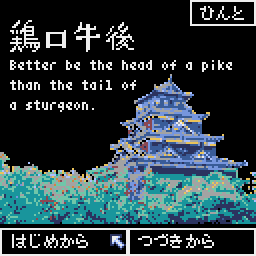
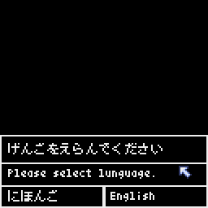
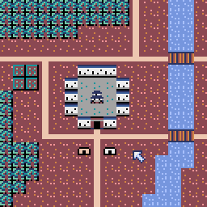
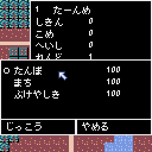
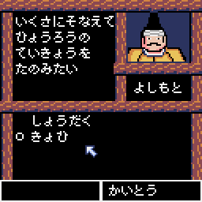
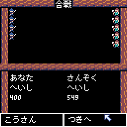

# sengoku 

pyxelのバージョンによって起動スクリプトが違います。 
pyxel Ver1.5.0 以降は [main.py] 
それより前は [main_old.py] からゲームを起動できます。 

The startup script differs depending on the version of pyxel. 
For pyxel Ver1.5.0 or later, use [main.py]. 
Before that, you can start the game from [main_old.py]. 
 

pythonのレトロゲームエンジン"pyxel"で作成したシミュレーションゲームです。 
This is a simulation game created with python's retro game engine "pyxel". 
 
日本の「戦国時代」をテーマにしています。 
The theme is Japan's "Sengoku-Jdai". 
 
 

言語は日本語と英語で作成しています。 
The game is in Japanese and English. *However, I am not confident in my English. 
 
 

プレイヤーは小さな領地の主となって、自国を発展させることを目指します。 
The player becomes the lord of a small territory and aims to develop his country. 

 
 

外交イベントや、戦闘が発生する場合もあります。 
Diplomatic events and even battles may occur. 

 
 

作者はWindows10、Windows11で開発を行っており、そのほかの環境での動作確認はしていません。 
I am developing on Windows 10 and Windows 11, and I have not tested the game on other environments. 
 

遊んでくれたらうれしいです。 
ご覧いただきありがとうございます。 
I'd be happy if you could play with it. 
Thank you for reading. 